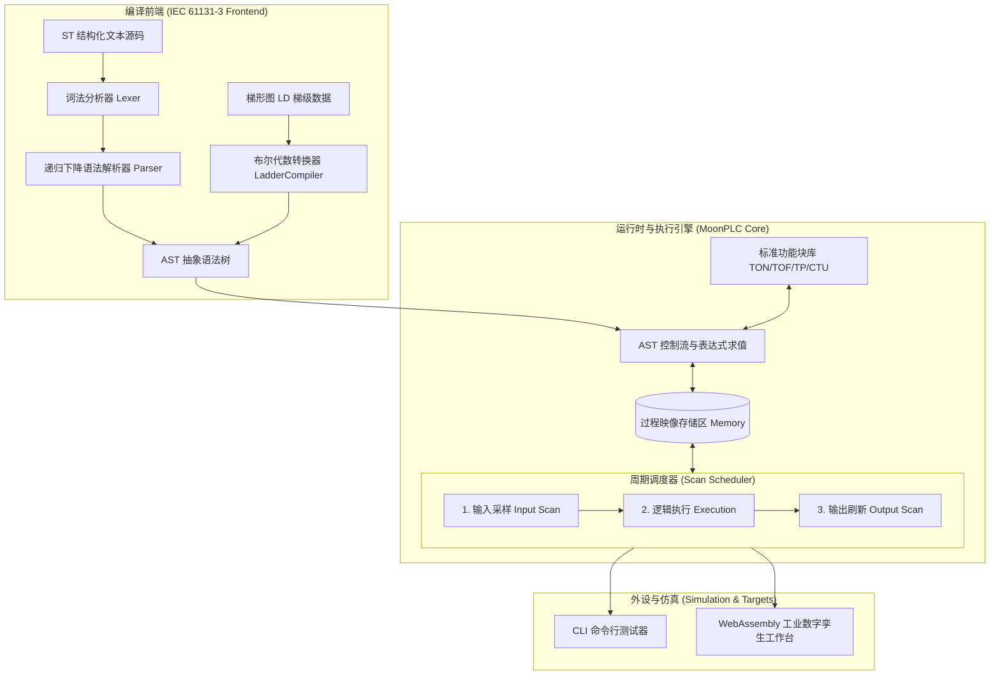

# MoonPLC: IEC 61131-3 Soft PLC Runtime & Simulator in MoonBit

[](https://github.com/lycvvt/Moonplc/actions)
[](LICENSE)
[](https://www.moonbitlang.com/)
[](https://moonbitlang.github.io/Hackathon2026/)

**MoonPLC** 是专为 **2026 MoonBit 黑客松** 打造的纯 MoonBit 实现的轻量级微型软 PLC 运行时系统（Soft PLC Runtime），包含 **IEC 61131-3 工业标准编程语言子集**（结构化文本 Structured Text, ST 与梯形图 Ladder Diagram, LD）编译器、毫秒级三段式扫描周期调度器以及 WebAssembly 浏览器工业孪生仿真控制台。

---

## 🌟 核心特性 (Key Features)

- 🦀 **100% 纯 MoonBit 实现 (Pure MoonBit)**：零第三方依赖，极致轻量，启动迅速，天然内存安全无崩溃隐患。
- 📜 **IEC 61131-3 语言子集支持**：
  - **结构化文本 (ST)**：支持完整词法解析（大小写无关、时间字面量如 `T#5s`、直接物理寻址 `%IX0.0`）、递归下降语法分析、表达式优先级爬升及控制流（`IF-THEN-ELSIF-ELSE`、`WHILE`、`FOR`）。
  - **梯形图 (LD)**：常开/常闭触点、输出线圈（Normal, Set, Reset）以及复杂串并联布尔网络直接编译为 AST。
- ⏱️ **标准功能块库 (Standard Function Blocks)**：
  - `TON`：通电延时定时器 (Timer On-Delay)
  - `TOF`：断电延时定时器 (Timer Off-Delay)
  - `TP`：脉冲定时器 (Timer Pulse)
  - `CTU`：增计数器 (Count Up)
- 🔄 **工业标准三段式扫描周期引擎 (Scan Cycle Scheduler)**：
  - 输入采样 (Input Scan) ➔ 逻辑执行 (Program Execution) ➔ 输出刷新 (Output Scan)。
  - 支持虚拟毫秒时基单步步进与连续自适应执行。
- 🖥️ **双形态交付 (CLI + Web SCADA)**：
  - 原生终端仿真 CLI（自带电机启保停与红绿灯周期测试）。
  - Web 端可视化仿真工作室（动态高亮梯形图、PLC 过程映像机架指示灯、三相交流电机与交通灯动态物理模拟）。

---

## 🏗️ 系统全景架构 (Architecture)



---

## 🚀 快速上手 (Quick Start)

### 1. 环境准备
确保已安装最新版 MoonBit 工具链：
```bash
# 验证版本 (推荐 >= 0.1.20260915)
moon version
```

### 2. 编译与运行测试
```bash
# 克隆仓库
git clone https://github.com/lycvvt/Moonplc.git
cd Moonplc

# 静态检查
moon check

# 执行完整单元测试 (16 项测试 100% 通过)
moon test
```

### 3. 运行 CLI 工业场景仿真演示
```bash
moon run cmd/main
```
输出终端将实时模拟：
- **场景 1**：工业电机自锁电路（按钮触发、松开自锁保持、停止按钮复位）。
- **场景 2**：交通路口红黄绿信号灯定时翻转状态。

### 4. 体验 Web 端工业数字孪生工作台
直接在浏览器中打开 `web/index.html` 即可启动 **MoonPLC Studio**：
- 点击面板上的 `%IX0.0` 模拟现场物理开关。
- 观察梯形图上的导通绿色电流与电机旋转/交通信号灯交替！

---

## 💻 API 使用示例 (MoonBit 代码)

```moonbit
import "lycvvt/moonplc" as plc

fn run_controller() {
  let controller = plc.MoonPlc::new("FactoryUnit1")

  // 1. 加载 IEC 61131-3 结构化文本逻辑
  let st_code =
    #|PROGRAM Conveyor
    #|VAR
    #|  Sensor AT %IX0.0 : BOOL;
    #|  Motor  AT %QX0.0 : BOOL;
    #|END_VAR
    #|IF Sensor THEN
    #|  Motor := TRUE;
    #|ELSE
    #|  Motor := FALSE;
    #|END_IF;
    #|END_PROGRAM
  controller.load_st(st_code)

  // 2. 模拟外设传感器触发输入
  controller.set_input_bool("%IX0.0", true)

  // 3. 执行一个 10ms 扫描周期
  controller.cycle(10L)

  // 4. 读取输出寄存器
  let motor_status = controller.get_output_bool("%QX0.0")
  println("Motor status: \{motor_status}") // true
}
```

---

## 📂 项目工程目录 (Repository Layout)

```
Moonplc/
├── moon.mod                    # MoonBit 模块元数据 (lycvvt/moonplc)
├── moon.pkg                    # 根库配置
├── types.mbt                   # PLC 数据类型、地址编解码
├── types_test.mbt              # 类型单测
├── ast.mbt                     # ST 抽象语法树与语句定义
├── lexer.mbt                   # 词法分析器 (Tokenization)
├── lexer_test.mbt              # 词法单测
├── parser.mbt                  # 递归下降语法分析器
├── parser_test.mbt             # 语法分析单测
├── ladder.mbt                  # 梯形图数据结构与编译引擎
├── ladder_test.mbt             # 梯形图自锁电路单测
├── memory.mbt                  # PLC 过程映像存储区 (%I, %Q, %M)
├── memory_test.mbt             # 存储区单测
├── fblocks.mbt                 # 标准功能块 (TON, TOF, TP, CTU)
├── fblocks_test.mbt            # 功能块单测
├── runtime.mbt                 # 扫描周期调度器与解释执行核心
├── runtime_test.mbt            # 扫描周期与多周期集成测试
├── moonplc.mbt                 # 顶层统一 Facade API
├── moonplc_test.mbt            # 端到端工作流测试
├── cmd/
│   └── main/
│       ├── main.mbt            # 命令行交互仿真程序
│       └── moon.pkg
├── web/
│   └── index.html              # 浏览器端 SCADA 工业数字孪生工作台
├── examples/                   # 经典工业控制案例
│   ├── 01_motor_start_stop.st
│   ├── 02_traffic_light.st
│   ├── 03_conveyor_sorting.st
│   └── 04_ladder_demo.json
├── PROPOSAL.md                 # 2026 MoonBit 黑客松官方申报说明书
├── .github/workflows/ci.yml    # 自动化 CI 持续集成
└── LICENSE                     # Apache-2.0 许可证
```

---

## 🏆 大赛申报与评审信息

- **赛事**：2026 MoonBit 九月黑客松（中国计算机学会 CCF、粤港澳大湾区数字经济研究院 IDEA 主办）
- **参赛者 GitHub**：[@lycvvt](https://github.com/lycvvt)
- **项目申报说明**：详见 [PROPOSAL.md](PROPOSAL.md)

---

## 📄 开源许可证 (License)

本项目采用 [Apache-2.0 License](LICENSE) 开源协议。
