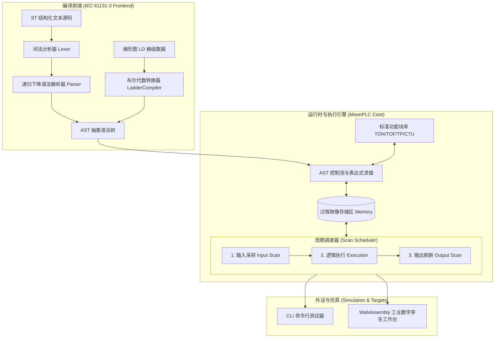

# MoonPLC: 软 PLC 运行时与 IEC 61131-3 子集编译器

[](https://github.com/lycvvt/Moonplc/actions)
[](LICENSE)
[](https://www.moonbitlang.com/)
[](https://moonbitlang.github.io/Hackathon2026/)

**MoonPLC** 是专为 **2026 MoonBit 黑客松** 设计的工业软件基础设施项目：采用 100% 纯 MoonBit 实现的轻量级微型软 PLC 运行时（Soft PLC Runtime）与 IEC 61131-3 工业标准编程语言（结构化文本 ST + 梯形图 LD）编译器，配备毫秒级确定性周期扫描引擎与浏览器端 WebAssembly 工业数字孪生仿真工作台。

---

## 🎯 项目目标 (Project Objectives)

1. **破局工业软件垄断，探索下一代自主工控语言基础设施**：
   传统软 PLC（如西门子 S7、德国 CODESYS、倍福 TwinCAT）长期闭源且收费高昂，开源项目（如 OpenPLC/MATIEC）技术栈老旧且存在 C 语言固有的内存安全缺陷。MoonPLC 旨在利用 MoonBit 的强静态类型、内存安全与极速编译特性，探索现代高可靠语言在 OT（运营技术）与工业边缘计算控制系统中的应用。
2. **轻量化 IEC 61131-3 工业语言子集编译器**：
   提供标准结构化文本（Structured Text, ST）与梯形图（Ladder Diagram, LD）的词法、语法解析与 AST 编译能力，支持将工业梯级布尔网络与复杂控制流转化为统一可执行中间表示。
3. **确定性毫秒级扫描周期执行引擎 (Scan Cycle Engine)**：
   严格还原工业控制器的核心调度机制——“输入采样（Input Scan）➔ 逻辑执行（Program Execution）➔ 输出刷新（Output Scan）”，内置看门狗（Watchdog）与时基调度器。
4. **全平台仿真与教学实验环境**：
   高校与工程师无需安装数十 GB 的庞大工业软件，即可在 PC 终端（Native CLI）或现代浏览器（WebAssembly）中以微秒/毫秒时钟精确仿真一台虚拟 PLC，并观察发光 I/O 指示灯、动态高亮梯形图及电机/交通灯物理动效。

---

## 📦 安装方式 (Installation)

### 1. 前置依赖准备
确保本地安装有 Git 以及最新版的 MoonBit 工具链：

- **安装 MoonBit 工具链** (Linux / macOS):
  ```bash
  curl -fsSL https://cli.moonbitlang.com/install/unix.sh | bash
  ```
- **安装 MoonBit 工具链** (Windows PowerShell):
  ```powershell
  irm https://cli.moonbitlang.com/install/powershell.ps1 | iex
  ```
- **验证安装**：
  ```bash
  moon version
  # 推荐版本 >= 0.1.20260915
  ```

### 2. 获取源码与编译构建
```bash
# 克隆仓库
git clone https://github.com/lycvvt/Moonplc.git
cd Moonplc

# 执行静态检查与依赖加载
moon check

# 编译项目与测试套件
moon test
```

### 3. 作为依赖引入到您的 MoonBit 工程
在您工程的 `moon.mod` 中添加依赖引用：
```moonbit
import {
  "lycvvt/moonplc"
}
```

---

## 📖 使用方法 (Usage Guide)

### 1. 命令行 CLI 交互仿真
项目内置了丰富的工业控制仿真示例程序，可直接通过 `moon run` 启动：
```bash
moon run cmd/main
```
终端将输出 ANSI 工业字符画，并按周期时序连续执行：
- 电机启保停自锁控制（按钮输入、自锁锁存、停止复位全过程）。
- 十字路口交通信号灯定时器延时翻转全过程。

### 2. 浏览器端 Web 工业数字孪生工作台 (MoonPLC Studio)
无需搭建后端或复杂服务，直接在浏览器中打开前端界面：
- **方式 A（直接双击）**：用任何现代浏览器（Chrome、Edge、Firefox、Safari）双击打开 `web/index.html`。
- **方式 B（本地 HTTP 服务）**：
  ```bash
  # 使用任意轻量 HTTP 伺服
  npx serve web
  # 或使用 python
  python -m http.server 8080 --directory web
  ```
- 打开后即可进入 SCADA 工业控制台：
  - 点击左侧下拉菜单切换案例（电机控制、智能交通灯、流水线推杆）。
  - 点击中间面板的 `%IX0.0` 模拟物理开关按下。
  - 实时观察梯形图发光导通回路、I/O 机架 LED 灯以及右侧电机旋转/红绿灯交替动效！

### 3. MoonBit 代码中调用 MoonPLC API
在 MoonBit 代码中引入并驱动软 PLC 运行时：

```moonbit
import "lycvvt/moonplc" as plc

fn main {
  // 1. 实例化一个软 PLC 控制器
  let controller = plc.MoonPlc::new("IndustrialUnit_01")

  // 2. 加载 IEC 61131-3 结构化文本 (ST) 程序
  let st_program =
    #|PROGRAM ConveyorControl
    #|VAR
    #|  Sensor_Item AT %IX0.0 : BOOL;
    #|  Piston_Push AT %QX0.0 : BOOL;
    #|END_VAR
    #|IF Sensor_Item THEN
    #|  Piston_Push := TRUE;
    #|ELSE
    #|  Piston_Push := FALSE;
    #|END_IF;
    #|END_PROGRAM
  controller.load_st(st_program)

  // 3. 模拟外部传感器信号输入 (%IX0.0 置为 TRUE)
  controller.set_input_bool("%IX0.0", true)

  // 4. 执行一个 10ms 扫描周期
  controller.cycle(10L)

  // 5. 读取物理输出映像寄存器状态
  let is_piston_active = controller.get_output_bool("%QX0.0")
  println("Piston state: \{is_piston_active}") // true

  // 6. 打印 PLC 内部完整 I/O 状态表与时基统计
  println(controller.dump_status())
}
```

---

## 💡 典型工业应用示例 (Examples)

所有示例源码均保存在 `examples/` 目录中：

### 示例 1: 电机自锁启保停控制 (Motor Start-Stop Self-Hold)
- **源码文件**：[`examples/01_motor_start_stop.st`](examples/01_motor_start_stop.st)
- **控制逻辑**：
  ```pascal
  Motor_Run := (Start_Btn OR Motor_Run) AND NOT Stop_Btn;
  ```
- **核心特点**：展示经典的梯形图常开触点、并联自锁回路与常闭停止触点互锁，断开启动按钮后依然能通过线圈自身触点维持接通。

### 示例 2: 道路十字路口智能交通信号灯 (Traffic Light Sequence)
- **源码文件**：[`examples/02_traffic_light.st`](examples/02_traffic_light.st)
- **控制逻辑**：
  ```pascal
  IF Car_Present OR Pedestrian THEN
    Light_Red := FALSE;
    Light_Green := TRUE;
    Timer_Pass(IN := TRUE, PT := T#3s);
    IF Timer_Pass.Q THEN
      Light_Green := FALSE;
      Light_Amber := TRUE;
    END_IF;
  ELSE
    Light_Red := TRUE;
    Light_Green := FALSE;
    Light_Amber := FALSE;
  END_IF;
  ```
- **核心特点**：结合工业级标准 `TON`（通电延时定时器），模拟车辆/行人触发后的毫秒级确定性时序转换。

### 示例 3: 自动化流水线物料感应与气缸分拣 (Conveyor Belt Sorting)
- **源码文件**：[`examples/03_conveyor_sorting.st`](examples/03_conveyor_sorting.st)
- **核心特点**：利用 `TP`（脉冲定时器）在物料触发光电传感器的瞬间输出固定宽度的气缸推杆动作，实现精准分拣与计数。

### 示例 4: 水箱恒温闭环 PID 控制系统 (Closed-Loop PID Tank)
- **源码文件**：[`examples/05_pid_temperature_tank.st`](examples/05_pid_temperature_tank.st)
- **核心特点**：展示工业连续过程控制中抗积分饱和、误差死区抑制与超温安全连锁保护机制。

### 示例 5: 梯形图 JSON 交换规范
- **源码文件**：[`examples/04_ladder_demo.json`](examples/04_ladder_demo.json)
- **核心特点**：提供规范化的抽象语法梯级 JSON 定义，支持与现代 Web 前端、组态软件及工业 SCADA 系统双向数据交换。

---

## 🔬 完整可复现的验证步骤 (Reproducibility)

为了让大赛评委和开源社区开发者能够 100% 精确复现本项目的运行与测试结果，请依照以下步骤验证：

### 步骤 1: 代码规范与静态检查验证
```bash
moon fmt --check || moon fmt
moon check
```
- **预期结果**：控制台输出 `Finished. moon: ran tasks, now up to date`，实现 **0 编译警告、0 语法错误**。

### 步骤 2: 全套自动化测试执行
```bash
moon test
```
- **预期结果**：
  ```text
  Total tests: 32, passed: 32, failed: 0.
  ```
  涵盖：数据类型编解码测试、ST 词法与语法分析测试、梯形图自锁电路编译测试、过程映像内存映射测试、TON/TOF/TP/TONR/CTU/CTUD 功能块测试、SR/RS 触发器、R_TRIG/F_TRIG 边沿检测、工业闭环 PID 控制器测试、Modbus 现场总线协议编解码测试、以及 IL 字节码虚拟机单步与跳转测试，全量 100% 绿色通过。

### 步骤 3: 终端工业仿真 CLI 运行复现
```bash
moon run cmd/main
```
- **预期输出**：
  ```text
  ================================================================
     IEC 61131-3 Soft PLC Runtime & Structured Text Simulator     
     Pure MoonBit Implementation | WebAssembly & Edge Ready       
  ================================================================
  [SCENARIO 1] Ladder Diagram: Motor Start-Stop Self-Hold Circuit
  >> Step 1: Initial state -> Motor_Run = FALSE
  >> Step 2: Press [START] Button -> Motor_Run = TRUE [MOTOR STARTED]
  >> Step 3: Release [START] Button -> Motor_Run = TRUE [SELF-LATCH MAINTAINED]
  >> Step 4: Press [STOP] Button -> Motor_Run = FALSE [MOTOR STOPPED]
  
  [SCENARIO 2] Structured Text: Traffic Light Timing Control
  >> Car Arrives! Triggering %IX0.0 = TRUE
     [At 50ms]  RED = false | GREEN = true | AMBER = false
     [At 110ms] RED = false | GREEN = false | AMBER = true
  ```

### 步骤 4: Web 端数字孪生交互复现
1. 双击打开 `web/index.html`。
2. 观察顶部状态栏显示 `PLC RUNNING`，周期计数器以 20ms 间隔平稳递增。
3. 点击 `%IX0.0 [启动/传感器]`：
   - 梯形图上的 `Start_Btn` 触点即刻变绿发光。
   - `Motor_Run` 线圈接通，右侧三相交流电机开始高速旋转（2800 RPM 动效）。
4. 再次点击 `%IX0.0` 取消按钮输入：电机依靠自锁常开触点维持平稳运转。
5. 点击 `%IX0.1 [停止]`：电机即刻刹车停止，完全吻合工业现场电气控制行为！

---

## 🏛️ 系统架构图 (Architecture)



---

## 📁 项目工程目录 (Repository Structure)

```
Moonplc/
├── moon.mod                    # MoonBit 模块定义
├── moon.pkg                    # 核心库包配置
├── types.mbt                   # IEC 基础类型与 %IX 寻址表示
├── types_test.mbt              # 类型单测
├── ast.mbt                     # ST 抽象语法树
├── lexer.mbt                   # 词法分析器
├── lexer_test.mbt              # 词法分析单测
├── parser.mbt                  # 递归下降语法解析器
├── parser_test.mbt             # 语法解析单测
├── ladder.mbt                  # 梯形图数据结构与转 AST 引擎
├── ladder_test.mbt             # 梯形图单测
├── memory.mbt                  # 过程映像区与变量符号表
├── memory_test.mbt             # 内存映像单测
├── fblocks.mbt                 # 工业标准功能块 (TON/TOF/TP/CTU)
├── fblocks_test.mbt            # 功能块单测
├── runtime.mbt                 # 周期调度引擎与解释执行器
├── runtime_test.mbt            # 周期扫描集成测试
├── moonplc.mbt                 # 统一 Facade API
├── moonplc_test.mbt            # 端到端工作流测试
├── cmd/
│   └── main/
│       ├── main.mbt            # CLI 命令行仿真程序
│       └── moon.pkg
├── web/
│   └── index.html              # 浏览器 SCADA 工业仿真控制台
├── examples/                   # 典型工业案例
├── PROPOSAL.md                 # 大赛项目申报说明书
├── .github/workflows/ci.yml    # GitHub Actions CI
└── LICENSE                     # Apache-2.0
```

---

## 🏆 赛事信息与评审致谢

- **参赛项目**：MoonPLC —— 软 PLC 运行时与 IEC 61131-3 子集编译器
- **参赛选手**：[@lycvvt](https://github.com/lycvvt)
- **主办单位**：中国计算机学会 (CCF)、粤港澳大湾区数字经济研究院 (IDEA Research)
- **项目申报说明**：详见 [PROPOSAL.md](PROPOSAL.md)

---

## 📄 开源许可证 (License)

本项目基于 [Apache-2.0 License](LICENSE) 开源。
